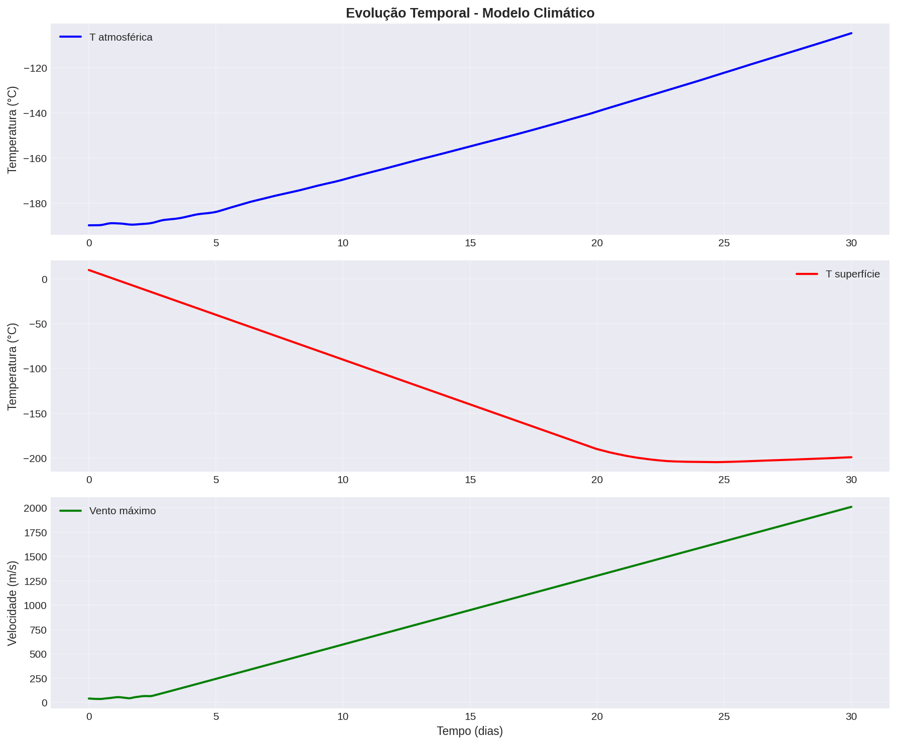
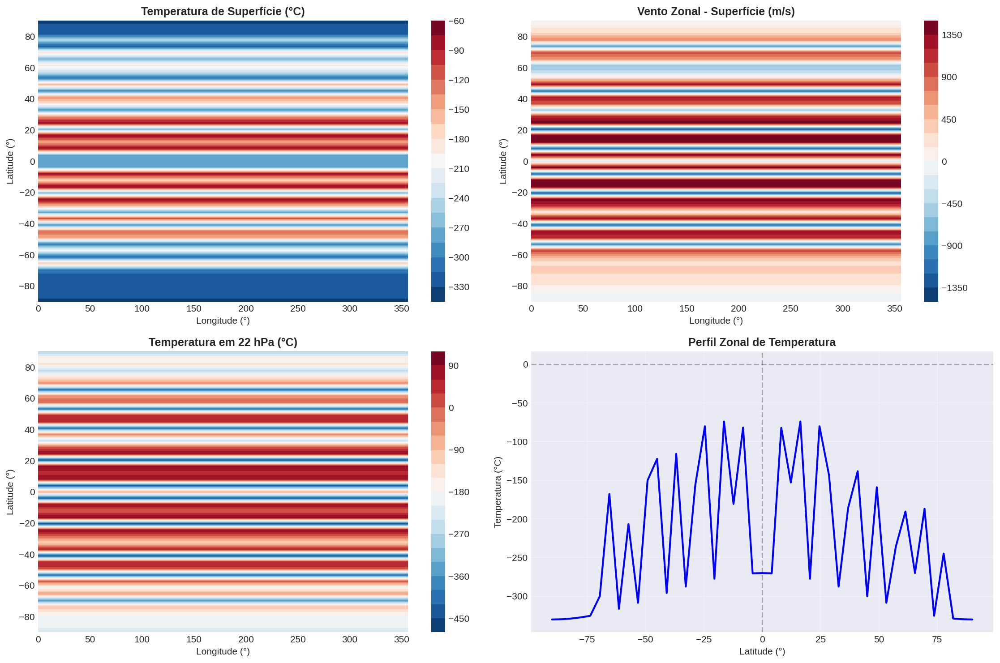
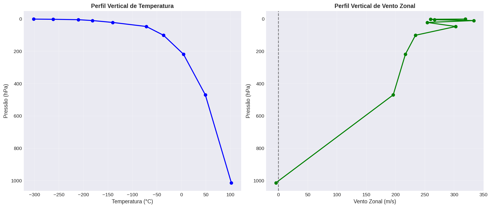

# 🌍 Modelo Climático Atmosférico

[](https://www.python.org/downloads/)
[](https://numpy.org/)
[](LICENSE)
[]()

> Sistema de modelagem climática baseado em equações primitivas para simulação da dinâmica atmosférica, balanço radiativo e transporte de umidade.

## 📖 Sobre o Projeto

Este projeto implementa um **modelo climático atmosférico** completo usando física realista e métodos numéricos avançados. O modelo resolve as equações primitivas da atmosfera em coordenadas esféricas, incluindo:

- 🌀 **Dinâmica de fluidos** (Equações de Navier-Stokes em esfera rotativa)
- 🌡️ **Termodinâmica atmosférica** com balanço de energia
- ☀️ **Balanço radiativo** (ondas curta e longa)
- 💧 **Transporte de umidade** e ciclo hidrológico
- 🌪️ **Força de Coriolis** e efeitos de rotação planetária

## ✨ Características Principais

- ✅ **Equações primitivas completas** em coordenadas esféricas (lat-lon)
- ✅ **Múltiplos níveis verticais** (pressão para atmosfera, profundidade para oceano)
- ✅ **Integração temporal** com Runge-Kutta 4ª ordem (RK4)
- ✅ **Operadores diferenciais** em geometria esférica
- ✅ **Balanço radiativo** com variação sazonal e latitudinal
- ✅ **Visualizações automáticas** dos resultados
- ✅ **Parametrizações físicas** (difusão, efeito estufa)

## 🔧 Requisitos

### Dependências Principais

```bash
python >= 3.8
numpy >= 1.20
matplotlib >= 3.3
scipy >= 1.6
```

### Instalação

1. **Clone o repositório:**

```bash
git clone https://github.com/seu-usuario/modelo-clima.git
cd modelo-clima
```

2. **Crie um ambiente virtual (recomendado):**

```bash
python -m venv .venv
source .venv/bin/activate  # Linux/Mac
# ou
.venv\Scripts\activate  # Windows
```

3. **Instale as dependências:**

```bash
pip install numpy matplotlib scipy
```

## 🚀 Uso Rápido

### Executar Simulação Completa

```bash
python simular.py
```

Isso executará uma simulação de 30 dias e gerará visualizações automáticas em `outputs/`.

### Exemplo Básico em Python

```python
from grid import GradeEspacial
from atmosphere import ModeloAtmosferico

# Criar grade espacial
grade = GradeEspacial(
    num_lat=45,          # 45 pontos em latitude
    num_lon=90,          # 90 pontos em longitude
    num_niveis_atm=10    # 10 níveis verticais
)

# Inicializar modelo
modelo = ModeloAtmosferico(grade)

# Executar simulação de 10 dias
historico = modelo.integrar(
    dias_simulacao=10,
    dt_horas=1.0
)

# Acessar resultados
temperatura_final = modelo.estado.temperatura_superficie
vento_zonal = modelo.estado.u
```

## 📁 Estrutura do Projeto

```
clima/
│
├── atmosphere.py       # Dinâmica atmosférica e equações primitivas
├── solver.py          # Métodos numéricos (RK4, difusão, advecção)
├── config.py          # Constantes físicas e parâmetros
├── grid.py            # Sistema de coordenadas lat-lon
├── radiation.py       # Balanço radiativo e efeito estufa
├── utils.py           # Funções utilitárias e conversões
├── simular.py         # Script principal de simulação
│
└── outputs/           # Resultados e visualizações
    ├── evolucao_temporal.png
    ├── campos_espaciais.png
    └── estrutura_vertical.png
```

## 🔬 Física Implementada

### 1. Equações Governantes

#### Momento (Navier-Stokes)
```
∂u/∂t = -u·∇u - v·∇u + fv - (1/ρ)∂p/∂x + Dᵤ
∂v/∂t = -u·∇v - v·∇v - fu - (1/ρ)∂p/∂y + Dᵥ
```

#### Termodinâmica
```
∂T/∂t = -u·∇T - v·∇T + Q_rad + Q_latente + D_T
```

#### Conservação de Umidade
```
∂q/∂t = -u·∇q - v·∇q + E - P + D_q
```

### 2. Parâmetros Físicos

| Parâmetro | Valor | Unidade |
|-----------|-------|---------|
| Constante Solar | 1361 | W/m² |
| Albedo Planetário | 0.30 | - |
| Gravidade | 9.81 | m/s² |
| R (ar seco) | 287.05 | J/(kg·K) |
| Cₚ (ar) | 1005 | J/(kg·K) |
| Ω (rotação Terra) | 7.29×10⁻⁵ | rad/s |

### 3. Métodos Numéricos

- **Integração temporal**: Runge-Kutta 4ª ordem
- **Diferenciação espacial**: Diferenças finitas centrais
- **Advecção**: Esquema upwind
- **Coordenadas**: Esféricas (lat-lon-pressão)

## 📊 Resultados Exemplo

### Evolução Temporal



### Distribuição Espacial



### Estrutura Vertical



## 📚 Módulos Principais

### `atmosphere.py`
- `EstadoAtmosferico`: Armazena variáveis de estado (T, u, v, q)
- `ModeloAtmosferico`: Motor principal do modelo com física completa

### `radiation.py`
- `ModeloRadiacao`: Balanço radiativo de onda curta e longa
- Forçante radiativa de gases de efeito estufa (CO₂, CH₄, N₂O)

### `grid.py`
- `GradeEspacial`: Sistema de coordenadas lat-lon
- Operadores diferenciais (gradiente, divergência, vorticidade, Laplaciano)

### `solver.py`
- `SolverRungeKutta4`: Integrador temporal RK4
- `SolverDifusao`: Solução de equação de difusão
- `SolverAdveccao`: Transporte advectivo

## ⚙️ Configuração Avançada

### Modificar Resolução

Edite `simular.py`:

```python
grade = GradeEspacial(
    num_lat=90,          # Maior resolução
    num_lon=180,
    num_niveis_atm=20
)
```

### Ajustar Parâmetros Físicos

Edite `config.py`:

```python
class ParametrosAtmosfera:
    CP_AR = 1005.0              # Calor específico
    DIFUSIVIDADE_HORIZONTAL = 1.0e5  # m²/s
```

### Alterar Duração da Simulação

```python
historico = modelo.integrar(
    dias_simulacao=100,  # Simular 100 dias
    dt_horas=0.5         # Passo de 30 minutos
)
```

## ⚠️ Limitações Conhecidas

1. **Estabilidade numérica**: Simulações longas podem desenvolver instabilidades
   - **Solução**: Reduzir passo de tempo (dt < 1h)
   
2. **Parametrizações simplificadas**:
   - Convecção não-resolvida explicitamente
   - Precipitação simplificada
   - Sem topografia

3. **Sem acoplamento oceânico**: Temperatura de superfície marinha é calculada, não forçada

## 🛣️ Roadmap

### Curto Prazo
- [ ] Implementar filtro de estabilização (Robert-Asselin)
- [ ] Adicionar condição CFL adaptativa
- [ ] Parametrização de convecção

### Médio Prazo
- [ ] Acoplar modelo oceânico simples (slab ocean)
- [ ] Implementar criosfera (gelo marinho)
- [ ] Validação com dados observacionais (ERA5)

### Longo Prazo
- [ ] Ciclo de carbono completo
- [ ] Química atmosférica (ozônio)
- [ ] Paralelização (MPI/GPU)

## 📖 Referências

1. **Cushman-Roisin, B. & Beckers, J.M.** (2011). *Introduction to Geophysical Fluid Dynamics*. Academic Press.

2. **Holton, J.R. & Hakim, G.J.** (2012). *An Introduction to Dynamic Meteorology*. 5th Edition. Academic Press.

3. **Vallis, G.K.** (2017). *Atmospheric and Oceanic Fluid Dynamics*. Cambridge University Press.

4. **IPCC AR6** (2021). *Climate Change 2021: The Physical Science Basis*.

## 🤝 Contribuindo

Contribuições são bem-vindas! Por favor:

1. Fork o projeto
2. Crie uma branch para sua feature (`git checkout -b feature/MinhaFeature`)
3. Commit suas mudanças (`git commit -m 'Adiciona MinhaFeature'`)
4. Push para a branch (`git push origin feature/MinhaFeature`)
5. Abra um Pull Request

## 📝 Licença

Este projeto está sob a licença MIT. Veja o arquivo [LICENSE](LICENSE) para mais detalhes.

## 👤 Autor

**Luiz Tiago Wilcke**

- GitHub: [@luiztiagowilcke188](https://github.com/luiztiagowilcke188)

## 🙏 Agradecimentos

- Comunidade científica de modelagem climática
- Desenvolvedores do NumPy, SciPy e Matplotlib
- IPCC e grupos de pesquisa em ciências do clima

---

<p align="center">
  Feito com ❤️ e ☕ para ciência climática
</p>
